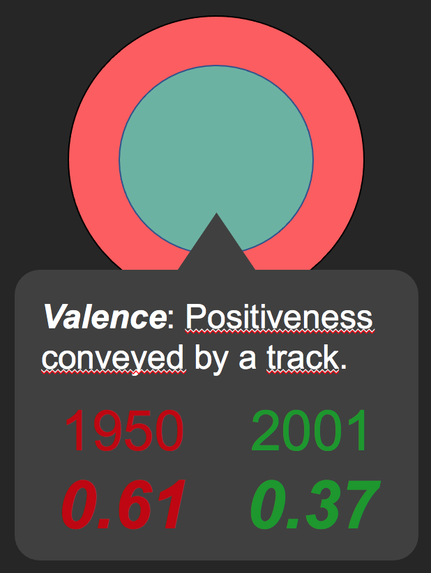

# COM-480 Data Visualization --- Spring Semester 2021
## Milestone 2

## Auguste Baum, Yanis Berkani & Clément Petit

The main goal of Music Trends is to visually depict the evolution of
(western) music over the last century, over many criteria and in varying
granularity (overview vs. comparison of 2 years). Towards this goal, we
are planning several visualizations:

# Timeline --- Core

The timeline will allow users to see the evolution of music throughout
the last century. For instance, it can be used to display the most
popular tracks of each year as shown here:

## User interaction

Hovering over a data point will cause a **tooltip** to appear containing
track information. The period of time shown will be made interactive
using a **brush** (at least a decade and at most a century; see bottom
of the previous Figures.
Finally the user will be able to choose
which musical feature they want to analyze, and also limit the data
shown to a single genre, using a **drop-down menu**.

## Tools and lectures

The focus and context system used to zoom in on a time period was
presented in exercise 5: "Time-series data & Multiple area charts". The
tooltip mechanism is linked to our lectures on interactive D3 "5.2. More
interactive D3" and is a common HTML/CSS tool. The drop-down menu makes
use of the `.on` call in D3 seen in lecture 5.2 and is also a common
HTML/CSS tool.

# Bubbles

This visualization allows the user to compare the musical features of
the music from 2 different years, as seen in the following Figure.

## User interaction

The user will be able to choose the two years that are compared, and the
bubbles might transition smoothly by an **animation**. The choice could
be made through a **drop-down menu** but it could also be made using two
**sliders** that span the whole range of years, as shown in this Figure

The user might also be able to choose the
features compared through a drop-down menu. The user will be able to get
the precise feature values by hovering on a group of bubbles, through a
**tooltip**, as shown in this Figure.

## Tools and lectures

The drop-down menu and tooltip will be the same mechanic as in the
timeline visualization, for coherence (and code reuse). The slider
mechanic will be based on the `rangeslider` mechanic that seems to be
common in HTML/CSS.

# Bar chart

This visualization will allow the user to study the evolution of the
popularity of genres over the years or decades. It will consist of a
interactive bar graph representing the popularity of each genre in a
single year or decade, and the bars could be ordered by popularity. When
a user changes years or decades, the graph would transition by first
changing the bars' height to obtain a graph similar to an audio
spectrum, before reordering genres in decreasing order of popularity.
This process is shown in the three next Figures.

The choice of year could be done using the slider mechanism discussed in
the bubble visualization and in addition we could have a way to animate
it (ie. increase the year every unit of time).

## Tools and lectures

See tools needed for the bubbles visualization; animations are covered
in lecture 5.2: "More interactive D3".

# Extra ideas

-   **Audio spectrum:** A musical journey through the years, where we
    show the top 3 songs of a certain genre (most popular at the time)
    and use the Spotify API to play the tracks. This would not exactly
    be a visualization but we believe that it would greatly increase the
    user experience.

-   **Pioneers:** We could show the impact of certain artists/tracks on
    a genre, i.e. when a genre has a large rise in popularity, which are
    the most popular artists/tracks at the time---we'd extrapolate by
    saying that those artists/tracks are "pioneers" of that genre. We
    could visualize this by comparing how popular was the genre of the
    artist/track before the track was released and afterwards in the
    form shown in the next figure.

Note that our project will be mainly using the following lectures: "Web
Development", "Javascript" (all lectures), "D3.js", "Interactions"; and
that we were also inspired by most of the other lectures.
