# Dataset & Exploratory Data Analysis

In such a project, choosing a clean dataset and conducting a thorough
Exploratory Data Analysis (EDA) is very important. Indeed, in order to
have good visualizations, we need to have useful and consistent data, as
well as the easiest access to information we can get. To achieve this
result, a first step is to spend some time looking for a pretty clean
and interesting dataset about the desired subject, which in our case is
music. After searching for some time, we got our data from Spotify,

cleaned for a Kaggle competition (you can find it [here](https://www.kaggle.com/yamaerenay/spotify-dataset-19212020-160k-tracks))
Then, before getting to the heart
of the matter, comes the part of understanding and analyzing the
dataset(s). Finally, after that we some some precise goals towards the
main objective: representing information in a visually interesting way.

For instance, in our case we decided to merge two datasets (tracks and
artists), to have access to both information about the track and the
artist in a single dataset. Then, we handled strange track names, we
removed completely silent tracks, we dropped duplicates and so on.
Finally, we processed the data to best fit our project's main goals. For
example, one of them is to visualize the evolution of popular genres,
hence we computed a dataframe containing the top 10% songs in terms of
popularity along with their genre for each year.

All of this takes a lot of time as we never know how precise we should
get, and when we have something in mind, even small fixes, it's very
hard to let go. One of the choices that we made to make our task way
easier when dealing with multi-artist tracks was to only take the first
one appearing in the featuring. We tried other solutions but it this
seemed to have the best balance between complexity of the method and
usability of the result.

Note that you can find out a lot more details about the features and
look at our data cleaning and processing in our repository (which you can find [here](https://github.com/com-480-data-visualization/data-visualization-project-2021-vizbrains)), in the
notebook called `EDA.ipynb`.

Let us now describe our process for the visualisations.

# Visualisations -- Design and Implementation

## Timeline visualisation

The timeline visualisation gives an overview of the most popular tracks
through the years, since the 1920s. We plot the most popular song for
each year in our dataset. Inspired by the lectures and exercises, we had
the idea to incorporate this visualisation in a "Brush & Zoom" chart.
After selecting one song for each year between 1922 and 2021, there were
a few difficulties we had to think about:

-   how to visually represent the songs;

-   how to dynamically add or remove songs to the graph, depending on
    the zoom amount;

-   how and when to display the song information;

-   how to make the zoom and brush behave well in this particular case
    as we cannot zoom indefinitely. The zoom has to stop when each
    consecutive year is visible on the $x$-axis. Hence it should not be
    allowed to rescale the graph directly with the Brush component.

After some research and several attempts, we came up with a first proof
of concept, shown in . The songs are represented by green circles, with
year on the $x$-axis and popularity on the $y$-axis. Hovering on a
circle causes it to be replaced by a tooltip containing the song title
and artist.

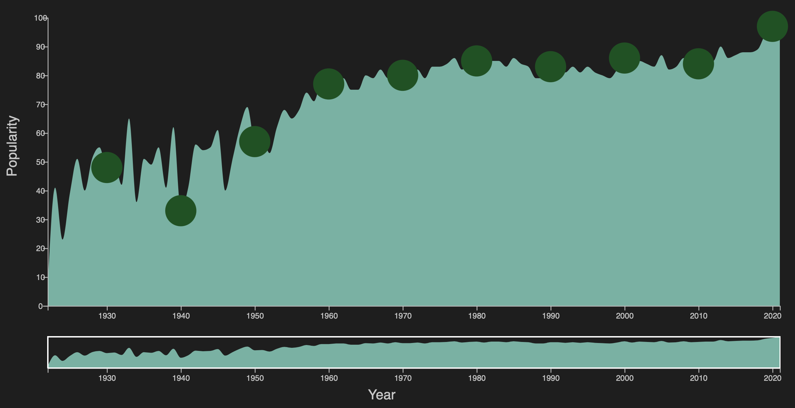
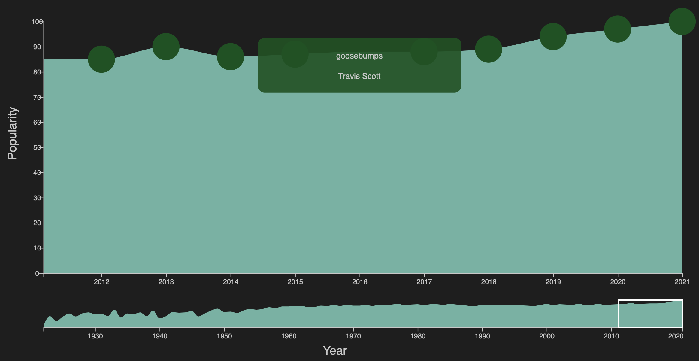

Then, we had the idea to incorporate sound samples for the user to have
a glimpse at each song. After all, in a project about music, it makes
sense to incorporate some sound elements. Spotify offers this
possibility with their "Spotify Embed" widget (see ). At first the idea
was to include the sample directly in the tooltip when hovering on a
song, but we quickly realised that our implementation with D3.js made
this impractical.

Another approach was to display the Spotify widget on a fixed position,
at the top of the visualisation. We finally went with this solution.
When the cursor is moved from the song, the sample stays at the top of
the visualisation, until another song is hovered over. Furthermore, the
songs titles and artists being displayed automatically in the Spotify
widget, there was no longer any point in displaying this information in
tooltips so we removed these. Instead, we added a small hovering effect
on the song circles. The final result is showed on . As a final note on
this first visualisation, regarding the colors, we chose to stay simple,
and pretty much match the Spotify color theme.

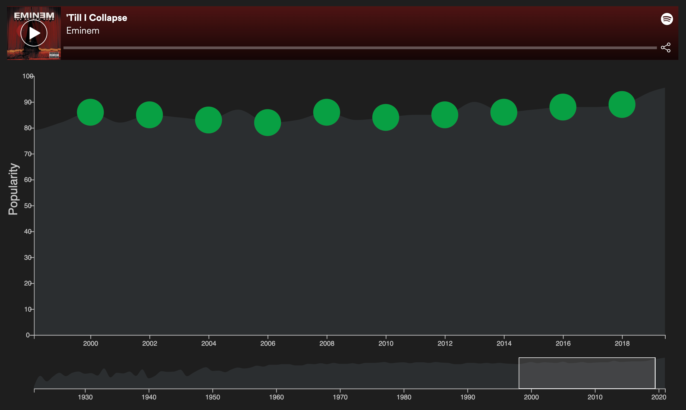
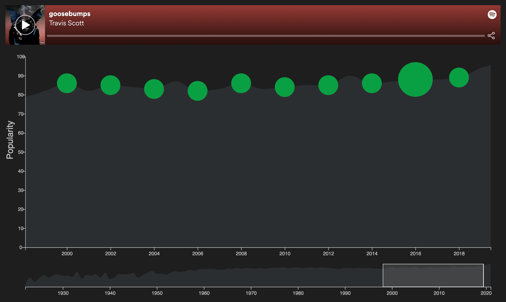

## Year comparator visualisation

The bubble visualisation aims to compare 2 years, according to some of
the features present in the dataset. It is still a temporal exploration
of the data which is similar to the timeline, except for that it is not
an overview anymore (but just a comparator). The intended use-case was
for example to give insight about claims like: "music is generally
easier to dance to now than during the disco years" or "music generally
gave more good vibes during the Beatles era".

The data plotted is the yearly average of the 20% most popular songs in
the dataset, where the values are normalised to the $[0, 1]$ interval.

Coming from a scientific background, the most obvious way for us to
achieve this would have been a bar chart with the features on the $x$
axis and the values on the $y$ axis. Though this might be an efficient
way to visualise this, we were sure that the freedom that comes with the
Web would lead us to a more innovative and powerful way to display our
findings.

As a first step, we considered using *bubbles* of varying area. The
choice of bubbles is often made on map visualisations to show where
effects are most prominent, but we argue this is often a poor choice,
using the visualisation on [this Johns Hopkins university
website](https://coronavirus.jhu.edu/map.html) as an example:

-   the amount of bubbles often makes the visual very messy;

-   the amount of bubbles can make the visual very computationally
    intensive: the above web page takes **20 to 30 seconds** from load
    time to displaying the bubbles;

-   humans are often not good at perceiving areas (see lecture 7.2.),
    which makes comparison difficult.

For maps, we maintain that coloring is a more sensible choice.

However, in our case we avoided these pitfalls: we superimposed the
bubbles so that we could clearly see which was the biggest, and the
absolute value of the features was secondary to us so we did not have to
worry about issues with perception. You can see our first prototype in .

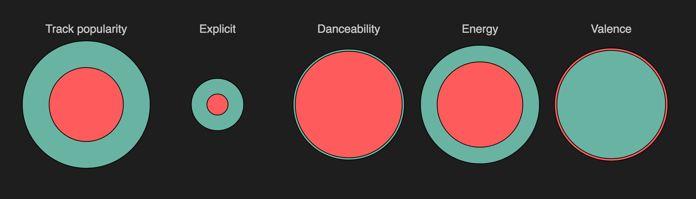

One can see that for each feature, the smallest bubble is always in the
foreground, which is obviously desirable otherwise we might only see one
bubble. This was somewhat technically challenging, because the concept
of $z$-order (i.e. foreground and background) does not really exist in
SVG: it's the order in which the elements are placed that determines
this. We managed to solve the issue with `use` tags, which make a copy
of an element.

At a glance this visualisation might seem satisfactory, but one can
notice an important issue with this. What we want to show is when the
years differ, but in , both danceability and valence are about the same
between the two years, and yet the two bubbles are completely different
colors, which is incoherent.

An alternative was to have the front bubble be 50% transparent, so that
when the two bubbles overlap the front color is always the same, as can
be seen in . But in this case we now have 3 colors, the front color that
stays the same regardless of which bubble is smallest, the back green
color and the back red color (that can be seen on the outside of the
Valence bubble). This is also disorienting for the user.

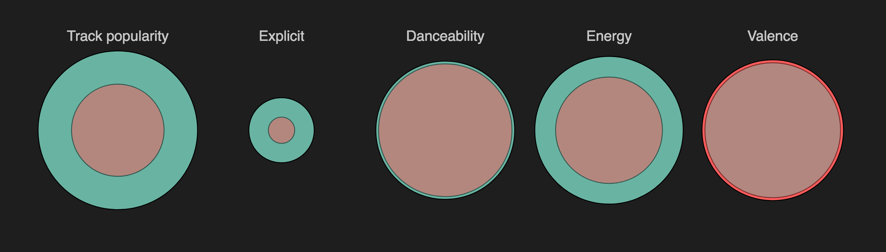

Finally, updating the size of the bubbles dynamically proved to be a bit
too difficult, especially regarding those `use` tags that were mentioned
earlier, and that were used to put the smallest bubble in front.

For all these reasons, we decided to change the visualisation format.

Our second (and current) version is a "lollipop" graph that resembles a
scatter plot. shows the visualisation in its current state, showing the
exact same data that was used in and .

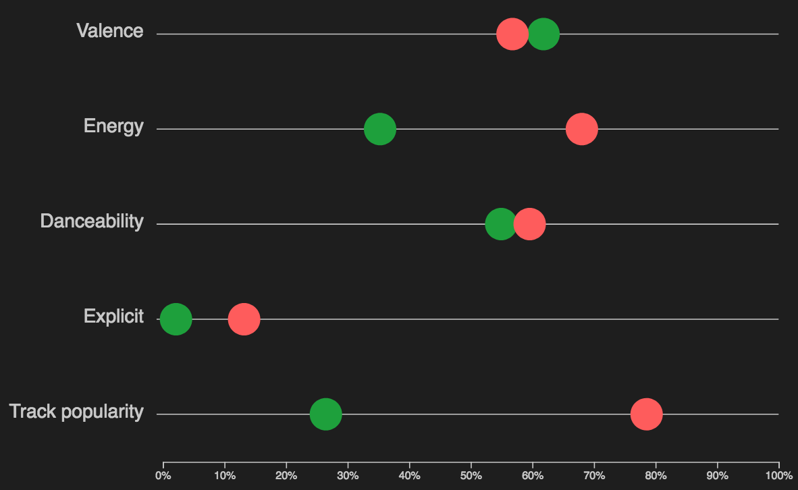

With this format comparison is also very easy, but now the absolute
value of the bubbles can also be displayed and understood easily.

Besides, the issue of having a certain element in the foreground is no
longer relevant.

The user of course has the choice of both years they want the data for.
The way this was done was with sliders. The rationale behind this and
the technical implementation are detailed in .

One debate was whether or not the user should also be given the choice
of the features that are displayed. Indeed, who is to say that they want
to know about acousticness and not about danceability? Adding as much
interaction as possible might make sense as a way to reinforce
engagement, but we are also aware (from experience) that too much
involvement from the user can lead to fatigue and loss of interest.
Besides, some features tend to vary only a little compared to others
that cover the whole spectrum, so these might give the impression that
our visualisation is uninteresting. For these reasons, we opted to
choose the best features and make this choice final. Of course if the
user knows Javascript they could go change the features in the source
code!

## Genres popularity visualisation

The last visualization consists in depicting music genre trends over the
last century. To be more precise, it is a dynamic bar chart showing the
popularity of the main music genres for a chosen year.

We directly thought of the idea of studying the evolution of musical
tastes, but we did not know how to visually represent it at first. After
some research, we were reminded of the spectrum technique that is often
used to visualise musical features in *individual* tracks (see next figure), which
lead us to the interactive bar chart idea.

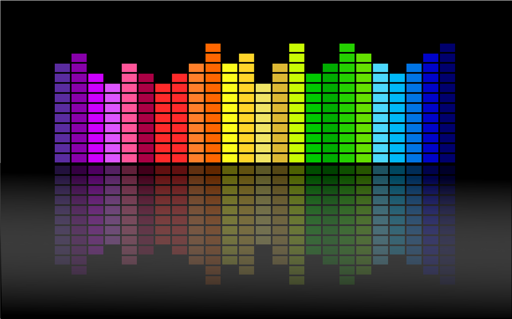

However there are some aspects that we had not anticipated at first:

-   **Non uniform distribution**: Genres popularity is unfortunately not
    distributed as uniformly as in , hence creating such a harmonious
    musical wave is impossible in our case.

-   **Genres ordering**: At first we wanted the graph to always keep the
    bars in descending order of popularity, for the user to instantly
    see what are the main genres of a particular year. However, in the
    end, we decided to rather order it randomly as it looks more like
    the spectrum and is still clear. The user still has the option to
    order the graph for the current year by clicking on a button. It is
    even more interesting as this way, they can also follow the evolution
    of top genres of a certain year throughout the century.

-   **Transition**: The idea that we mentioned in Milestone 2 (see ) was
    to have a "loading" phase that would look similar to . However, we
    finally decided to simply transition from previous to current state,
    as it actually looked nicer.

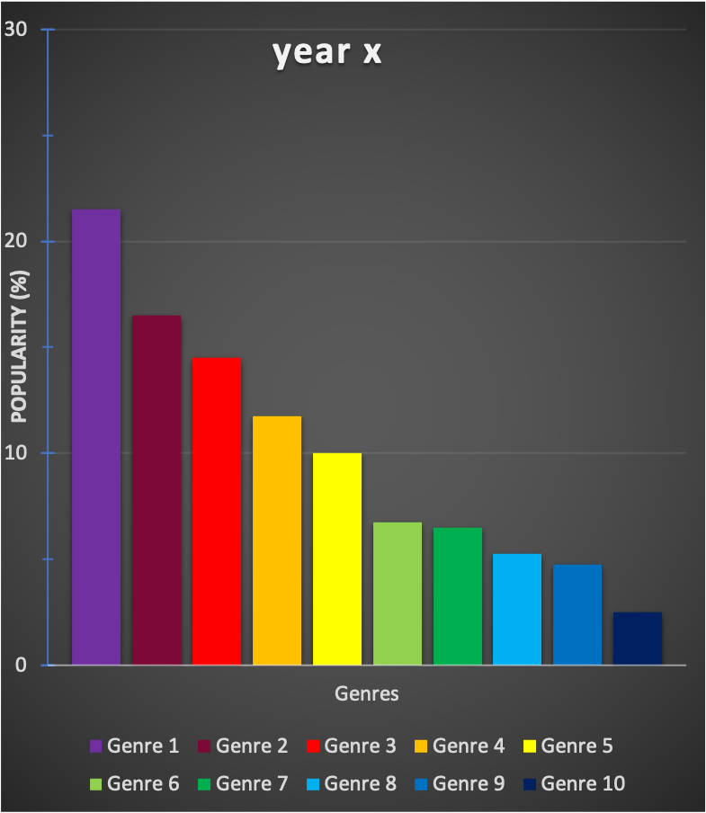
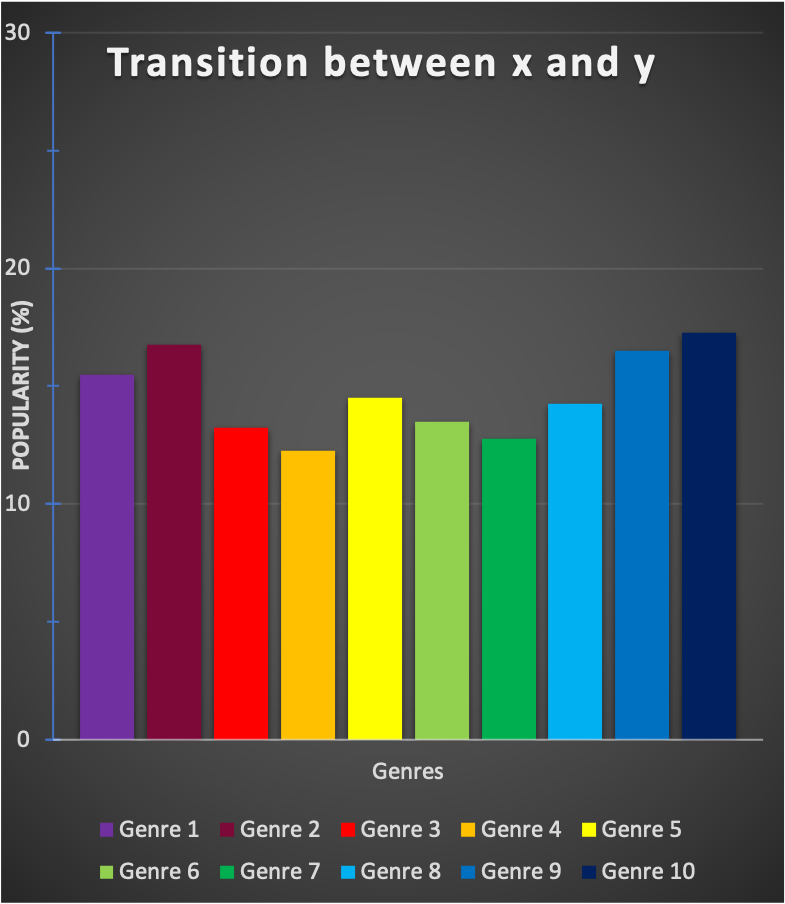
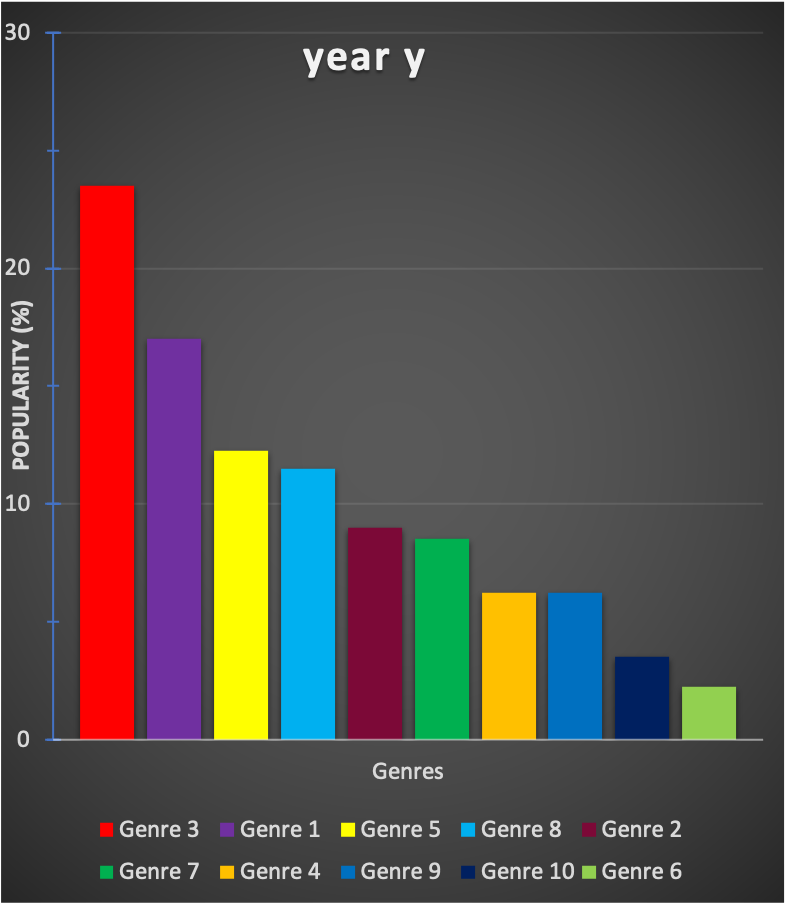

# Individual features

## Sliders {#sec:sliders}

The sliders can be used to change a given parameter dynamically so that
the change can happen as the slider is moved. This is not quite the same
as a drop-down menu because the former can be used to get a general idea
of the behaviour of the data as the parameter changes, without having to
plot the data directly.

For example, the main purpose of the bubble visualisation is to compare
two years; the timeline visualisation is obviously best for visualising
the behaviour as the year changes, but plotting 5 curves at once would
make it unreadable. The slider feature in the bubble visualisation is a
compromise between the number of points of comparison and the temporal
behaviour.

This feature involved refreshing the data that is shown, and hence it
was made easier using D3's `enter` and `update` constructs. However, one
issue is that it seems difficult to avoid repeated code. Indeed, the
drawing has to be made once at load time for the `circle` elements to be
created, (see the `draw` method) and then it has to be refreshed using
the new data at each new slider position; a `transition()` call is used
then to guarantee fluidity and clarity. These two phases, though
extremely similar, did not seem to be modularisable.

## Tooltips

The idea of tooltips is to only show information when it is needed; it
allows for different levels of precision in a visualisation, so that it
can reach a wider range of people. Indeed, some might be happy with a
less detailed but more elegant picture, whereas others might prefer
sacrificing a bit of simplicity to get more precise information.

We use tooltips in several places throughout the project:

-   in the timeline visualisation we can display the most popular song
    of each year;

-   in the bubble visualisation we give a description of the musical
    features being plotted---though most are self-explanatory, some can
    appear a bit cryptic.

First we used `rect` element that were placed and removed on mouse
events, but then we used a `div` tag that is made opaque or transparent.

This second attempt, though more efficient (as it doesn't require
deleting shapes), proved more difficult than expected because it
involves including HTML elements into an SVG canvas. For example, the
placement of the tooltip in the bubble visualisation should be next to
the feature that is hovered on, but the `mouseover` function does not
have access to the coordinate system of the SVG canvas; we could make
those functions internal to the plot constructor, but then the `this`
object in `mouseover` and `mouseout` would not refer to the right
element anymore.

One major difficulty we found while working on this project was to
modularise our code; even though we would much rather have used the same
code in both cases, the two use cases were different enough that it
seemed not worth the effort.

# Peer Assessment

Despite the current situation, the three of us managed to collaborate
well together on this project. We relied on a good communication, with
bi-weekly Zoom calls (on Mondays and Fridays) and a group chat.

At first, a big part of the work was to brainstorm and share ideas, in
order to make decisions and to set our goals.

Our final result mainly consists in three visualizations, that we mostly
carried out individually. While working in parallel, we shared
implementation ideas and code snippets to help each other and maximize
efficiency.

Hence we each mostly focused ourselves on the following tasks:

-   Clément Petit: Timeline visualisation & Website Design

-   Auguste Baum: Year Comparator visualisation & Screen Cast

-   Yanis Berkani: Genres Popularity visualisation & EDA

Auxiliary work consisted in writing the reports, for which we all
participated equally.

# Conclusion

We really enjoyed working together as a team on this project and we are
very satisfied about the final result. This work allowed us to discover
new insights on a topic we all are passionate about, while learning how
to use very important web development and data visualization tools.

Finally, we would like to thank our Professor Laurent Vuillon for this
course and his help on Friday exercise sessions.
